<div align="center">


<p>
  <a href="https://kestrel-flyt-base-3kcq-roan.vercel.app/" target="_blank">
    
  </a>
  <a href="https://kestrel-flytbase.onrender.com/api/health" target="_blank">
    
  </a>
  
  
  
  
</p>

<p>
  
  
  
  
  
  
  
  
  
  
  
</p>

<br/>

### 🦅 Autonomous Drone Security & Tactical Threat Intelligence Platform

> 🚀 **Live Production App:** [https://kestrel-flyt-base-3kcq-roan.vercel.app/](https://kestrel-flyt-base-3kcq-roan.vercel.app/)  
> 📡 **Hosted Cloud Backend:** [https://kestrel-flytbase.onrender.com](https://kestrel-flytbase.onrender.com)

**KESTREL** is an autonomous, multi-modal drone security analyst agent engineered to transform raw high-throughput aerial video and telemetry into real-time threat perception, spatial-temporal entity memory, and automated tactical dispatch.

> **The Perception Economy:** A patrol drone produces 57,600 frames per shift. Captioning every frame with Vision-Language Models isn't just expensive, it's *arithmetically impossible*. KESTREL solves this with a **five-tier perception cascade**: its core focus isn't just model capability, but **intelligent frame admission**, ensuring only high-value events reach expensive models.

<div align="left">

#### 🌟 Key Architectural Innovations
- ⚡ **Tier-0 Cost Gate:** Sub-3ms visual variance filter dropping static frames to slash VLM compute costs by **>82%**.
- 🧠 **Spatial-Temporal Memory Pyramid:** 3-tier entity ledger using CLIP 512D embeddings and movement vectors for target re-ID across occlusions and drone sector handoffs.
- 📜 **Natural Language Rule Compiler:** Converts plain-English security policies into deterministic AST temporal rules with **<200ms** historical backtesting.
- 🛸 **Geospatial 3D Tactical Command Center:** Real-time MapLibre GL geospatial map, Three.js drone rendering, threat vectors, and automated tactical dispatch engine.
- 🔒 **SHA-256 Cryptographic Audit Ledger:** Tamper-evident evidence chain-of-custody logging for legal and compliance auditability.
- 🤖 **LangGraph Agent Control Plane:** 14 bound operational tools powering real-time conversational intelligence with Server-Sent Events (SSE) streaming.

</div>

<br/>

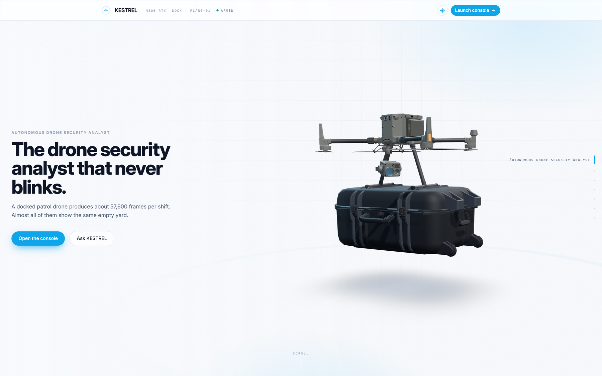

</div>

---

## Table of Contents

- [Live Deployment](#live-deployment)
- [The Problem](#the-problem)
- [What I Built](#what-i-built)
- [Run It Locally](#run-it-locally)
- [A Guided Tour](#a-guided-tour)
- [The Five-Tier Cascade](#the-five-tier-cascade)
- [The Assignment, Requirement by Requirement](#the-assignment-requirement-by-requirement)
- [Novelties and Feature Highlights](#novelties-and-feature-highlights)
- [Architecture](#architecture)
- [Tech Stack](#tech-stack)
- [Data Model](#data-model)
- [Evaluation](#evaluation)
- [What Went Wrong, and What It Cost](#what-went-wrong-and-what-it-cost)
- [Honesty Constraints, Enforced in Code](#honesty-constraints-enforced-in-code)
- [Project Structure](#project-structure)
- [Author](#author)

---

## Live Deployment

| Component | Platform | Endpoint / Link | Capabilities |
| :--- | :--- | :--- | :--- |
| **Console Web App** | **Vercel** | [https://kestrel-flyt-base-3kcq-roan.vercel.app/](https://kestrel-flyt-base-3kcq-roan.vercel.app/) | Next.js 15, MapLibre 3D tactical radar, real-time alert triage, natural-language query |
| **Inference Backend** | **Render** | [https://kestrel-flytbase.onrender.com](https://kestrel-flytbase.onrender.com) | FastAPI cloud worker, live SQLite-vec index, Groq & NVIDIA NIM integration |
| **System Health** | **Render** | [https://kestrel-flytbase.onrender.com/api/health](https://kestrel-flytbase.onrender.com/api/health) | Live telemetry, provider availability status, cassette statistics |
| **Interactive Docs** | **Render** | [https://kestrel-flytbase.onrender.com/docs](https://kestrel-flytbase.onrender.com/docs) | OpenAPI / Swagger interactive endpoint specification |

---

## The Problem

Point a camera at a fence for eight hours and almost nothing happens. That is the whole difficulty. The signal is
rare, the footage is enormous, and the moment that matters lasts four seconds.

The naive build sends every frame to a vision model. Do the arithmetic before writing the code:

| | |
|---|---|
| Frames in one 8-hour shift at 2 fps | **57,600** |
| Model calls the free tier permits in the same window | **~19,200** |
| Multiplier as you add drones and sites | **linear, in the wrong direction** |

There is no prompt that fixes this. It is a budget problem wearing a machine-learning costume, and it decides the
architecture: **local perception is free and runs on every frame; hosted inference is scarce and must be earned.**

The second problem is worse, because it is invisible. A security system that cries wolf gets switched off in a
week, and then protects nothing. So the evaluation here weights **the alerts that must not fire** exactly as
heavily as the ones that must. Three of the eight scenarios expect silence.

---

## What I Built

An autonomous security analyst for a docked patrol drone: it watches real footage, understands what it sees in
the context of *where* and *when* it saw it, raises alerts with dispatchable coordinates, remembers subjects
across days and sites, and answers questions about any of it in conversation.

```
Gate  ->  Detect  ->  Track  ->  Embed  ->  Describe  ->  Reason  ->  Act
CPU       YOLO11     ByteTrack   2048-d     11B VLM      rules +    mission,
arith.    ~12 ms     identity    joint      scene        memory     approval,
free      on-device  over time   space      graph        pyramid    ledger
```

- **A dense playback index** over real footage: every sampled frame carries boxes, track ids, zone membership and
  the gate's own verdict, so you watch the pipeline's actual output rather than a rendering of it.
- **Five tiers with measured costs**, and a gate that decided **38.9%** of real frames never needed a model.
- **Geo-projection from pixel to ground**, so every alert carries a bearing, a distance and a dispatch coordinate.
- **A temporal memory pyramid** (clip, shift, day) that compresses without losing the citation trail.
- **Cross-site correlation**: the same white panel van at three sites in 42 hours, which no single site can see.
- **A conversational control plane** where every capability is a tool, and the ones that change state stop for
  human approval, enforced in the registry rather than in a prompt.
- **Bring your own footage**: upload a clip, type where it was filmed, and watch it index, detect and alert with
  coordinates near that place.
- **A hash-chained audit ledger** where declining a drone launch is recorded as firmly as approving one.
- **125 automated checks** and **100 tests** that run with no API key and no network.

---

## Run It Locally

The repository ships **1,280 recorded model responses**, so the whole system runs with no keys at all.

```bash
git clone <your-private-repo-url> kestrel
cd kestrel

uv sync                                   # Python 3.12, ~90s
npm --prefix web install

cp .env.example .env                      # optional; see the table below

uv run kestrel serve                      # terminal 1  -> http://127.0.0.1:8000
npm --prefix web run dev                  # terminal 2  -> http://localhost:3000
```

Open **http://localhost:3000**, click **Open the console**, press play on Worker Zone, and watch boxes track a
person while the gate ribbon shows which frames it refused to spend a model on. Then ask the analyst
*"what happened last night?"* and click a citation.

| Variable | What it unlocks | Without it |
|---|---|---|
| `NVIDIA_API_KEY` | Vision captioning, embeddings, deep escalation | Replays 1,280 recorded responses |
| `GROQ_API_KEY` | Primary reasoning model, ~220 ms | Fails over to NVIDIA `llama-3.1-70b` |
| `NEXT_PUBLIC_MAPTILER_KEY` | Satellite and street basemap | Zone geometry renders on a plain canvas |
| `KESTREL_MODE` | `replay` needs no network; `live` calls out | Defaults to `replay` |

```bash
uv run pytest -q                           # 100 tests, no network
uv run python scripts/run_evals.py         # scenarios, chaos, retrieval, gate
uv run python scripts/probe_models.py      # what the API actually serves today
uv run python scripts/inspect_all.py       # 125 end-to-end checks
cd report && latexmk -pdf 01-main-report.tex
```

---

## A Guided Tour

### The console: real footage, real detection, in real time

Not a rendering. A `<video>` element playing the source clip at its native frame rate with a canvas overlay
driven by the prebuilt index, interpolating between samples by track id. The ribbon under the player is the
**gate's decision per frame**. Every dash is a frame it chose not to spend a model on. `GATED
STATIC(d=none,delta=0.0101)` is the gate saying this frame is 1% different from the last one, so it is not worth
looking at.

<p align="center">
  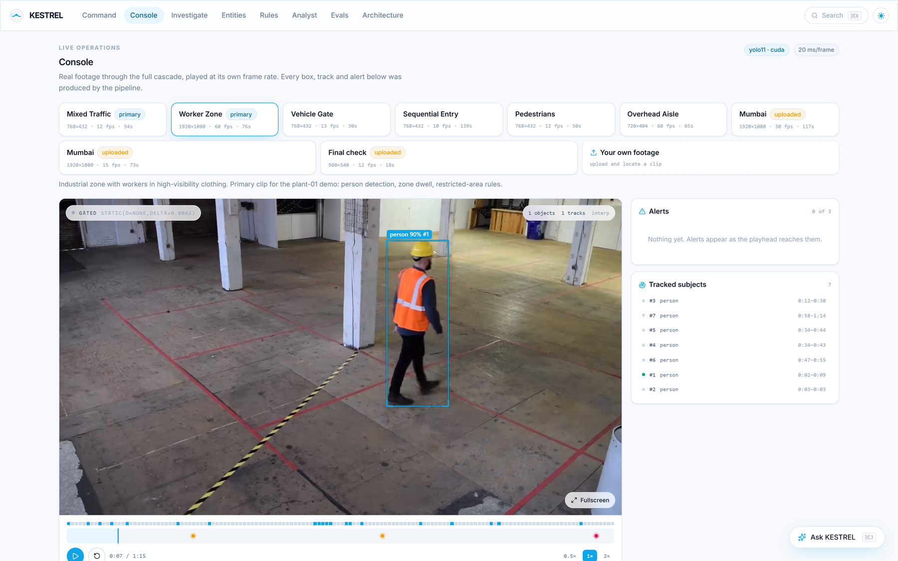
</p>

Nine clips ship, six bundled and three uploaded. Every one carries its resolution, frame rate and duration,
because a demo that hides its inputs is hiding something.

### Bring footage the system has never seen

The strongest evidence it is not a canned demo. Upload a clip, type where it was filmed as coordinates or a place
name, and the same detector, tracker, projection and rule engine run against it, anchored at that location, so
its alerts carry dispatchable positions near that place rather than near the demo site.

<p align="center">
  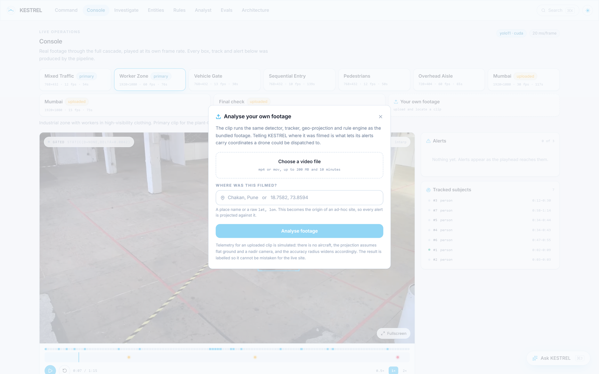
</p>

Uploads are converted to browser-safe H.264 on ingest, validated before acceptance, capped at 200 MB and ten
minutes, and their telemetry is labelled **simulated** everywhere it appears.

### Ask it anything, and watch it refuse

Every capability is a tool. The agent plans, calls, and cites. The interesting screenshot is not the one where it
answers, it is this one: **`OUT_OF_SCOPE`, 0 tool calls, 0 ms.** Scope is decided by local code *before* any model
runs, so it works with the network unplugged and cannot be talked out of it by the question.

<p align="center">
  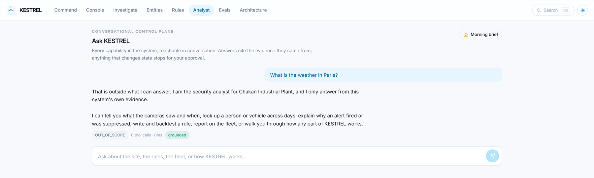
</p>

And when it does answer, the evidence is on screen: the tool it called, the memory tier the summary came from,
and the frame ids behind every claim.

<p align="center">
  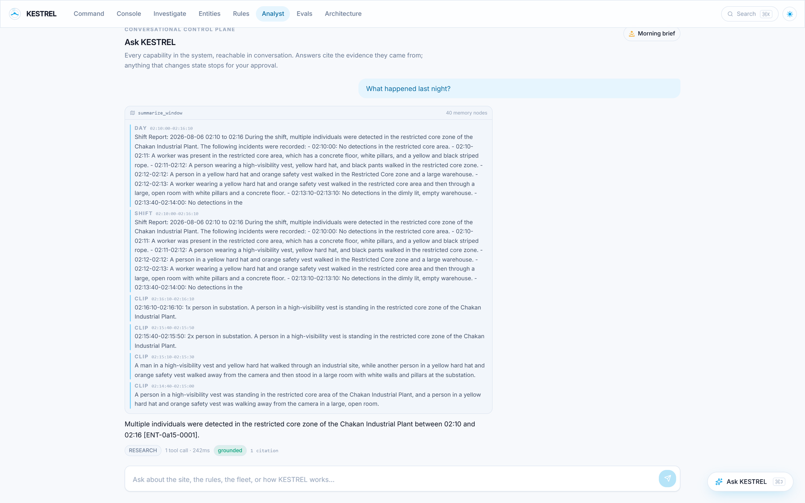
</p>

### The site: zones, alerts and where to send the drone

Real basemap, real zone polygons with their priority multipliers and operating hours, the flight path, and six
dispatch positions. Each alert carries **distance and bearing** because "someone at the substation" is not
actionable and "226 m, 43° NE" is.

<p align="center">
  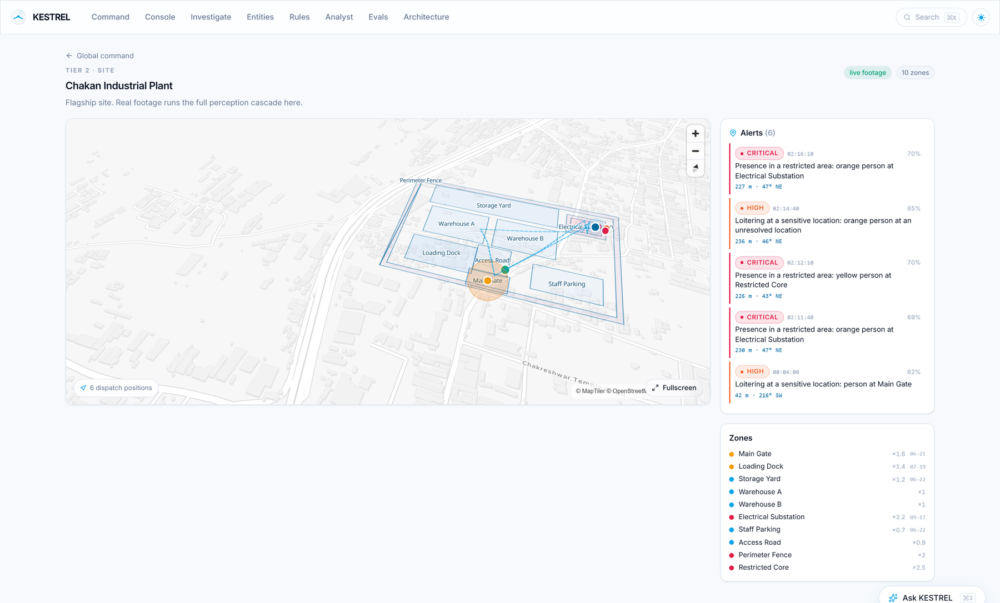
</p>

### Deploy the drone, and watch it stop and ask

A critical alert is not the end of the job, it is the start of a decision. Click **Deploy drone** on one and
KESTREL plans the response: it takes the alert's projected ground position, works out bearing, distance, ETA and
a safe altitude, checks the flight against battery reserve, geofence, wind and daylight, flies it on screen,
and then holds.

<p align="center">
  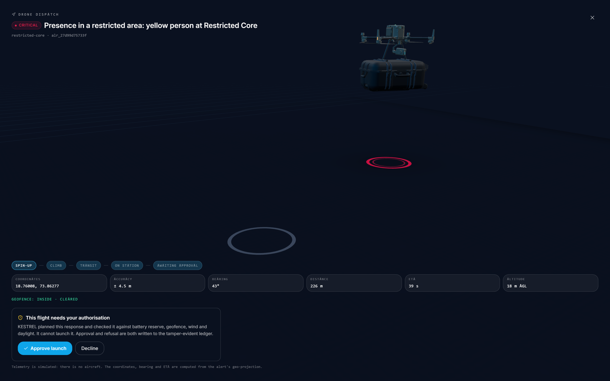
</p>

Then the part that matters. Everything above was the system reasoning. This is where it runs out of authority:

<p align="center">
  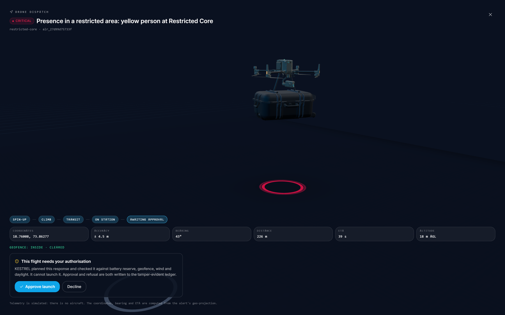
</p>

> **This flight needs your authorisation.** KESTREL planned this response and checked it against battery reserve,
> geofence, wind and daylight. **It cannot launch it.** Approval and refusal are both written to the
> tamper-evident ledger.

The wow moment is also the argument. `SPIN-UP → CLIMB → TRANSIT → ON STATION → AWAITING APPROVAL` is a sequence
that **cannot complete on its own**, and that boundary is enforced in the tool registry rather than in a prompt:
`approve_mission` is a CONFIRM tool, the agent's own loop has no way to pass the approval flag, and a test reads
the source to assert `approved=True` never appears in it. Declining is written to the ledger just as firmly as
approving, because a refusal you cannot prove is not a control.

Note the last line of that screenshot: *"Telemetry is simulated: there is no aircraft. The coordinates, bearing
and ETA are computed from the alert's geo-projection."* The coordinates are real arithmetic on a real alert. The
aircraft is not, and the overlay says so rather than letting the cinematics imply otherwise.

### The portfolio: one drone is the assignment, sixteen sites is the argument

Sites shaded by aggregate threat, a real day/night terminator from solar position (four of sixteen in darkness
right now, which is exactly when the after-hours rules change behaviour), and correlation arcs between sites that
have seen the same subject.

<p align="center">
  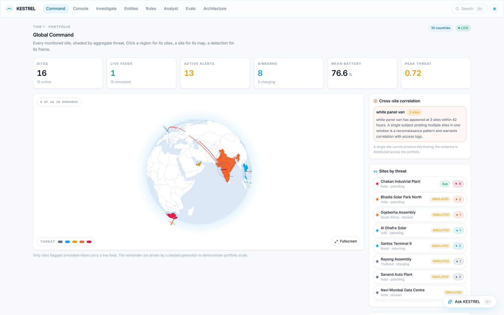
</p>

> **white panel van, 3 sites, 42 hours.** A single site cannot produce this finding. The evidence is distributed
> across the portfolio, and that is the whole point of the tier.

### Rules you can write in English, and backtest before enabling

<p align="center">
  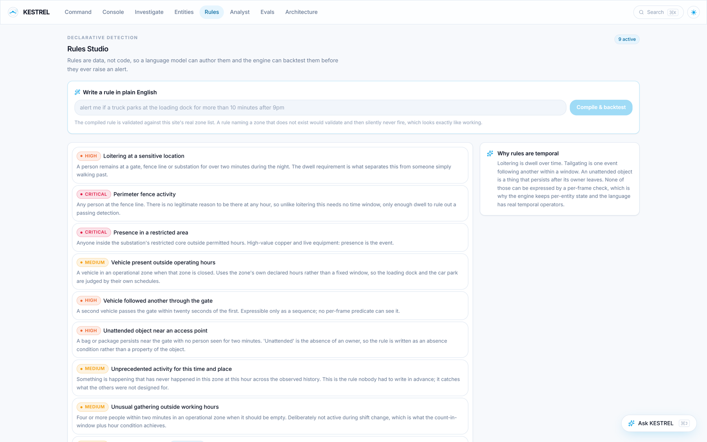
</p>

Rules are declarative data, not code, and temporal rather than per-frame. A new rule is compiled, validated,
backtested against recorded history, and only then offered for activation.

### Entities, investigation and evaluation

<p align="center">
  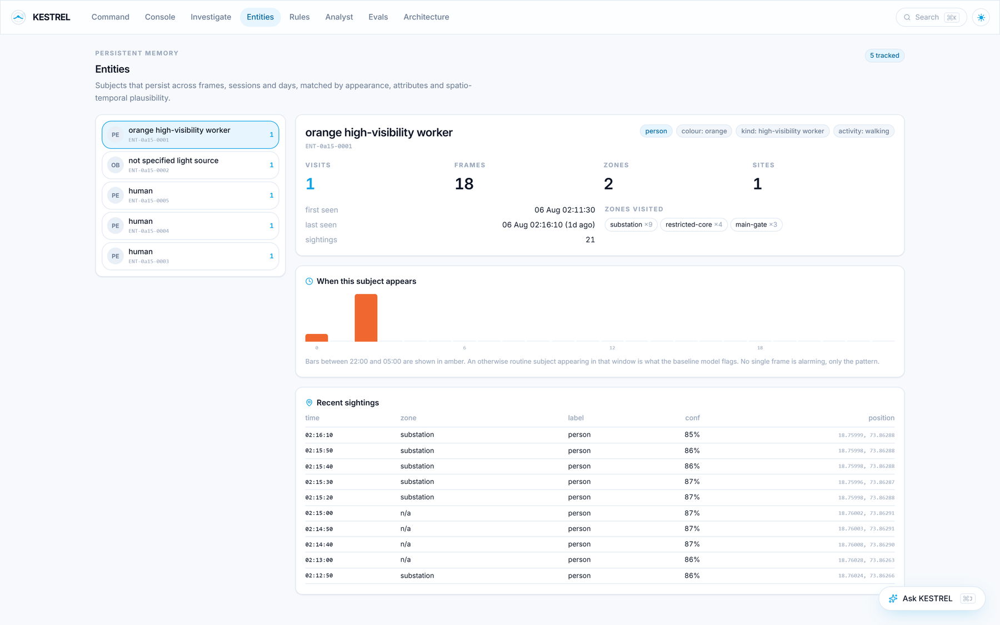
  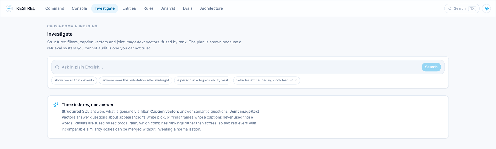
</p>

<p align="center">
  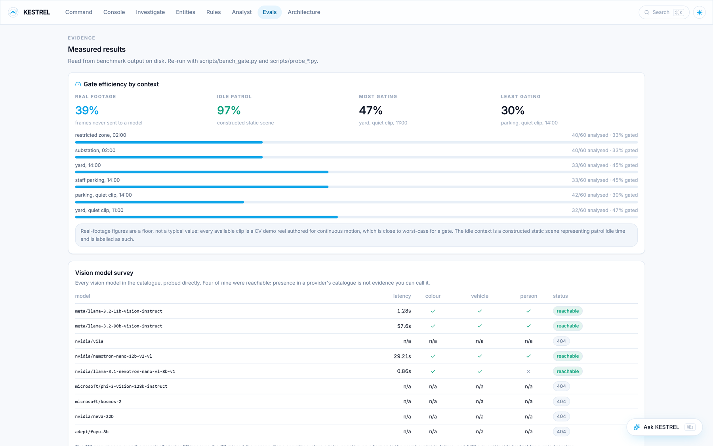
  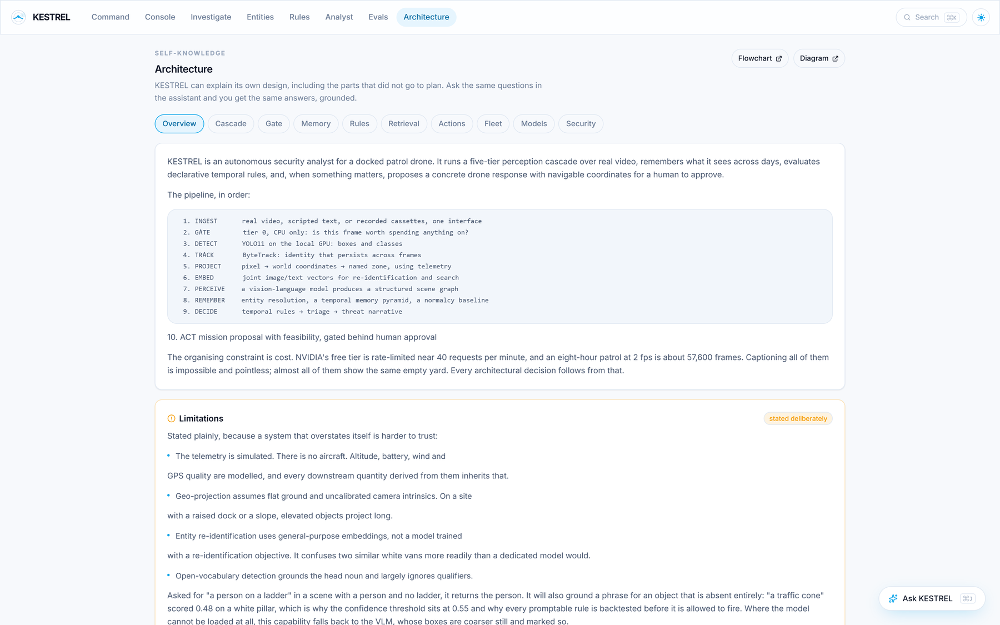
</p>

The evaluation deck reports the number that did not survive contact with data: the design plan asserted ~94% of
frames would skip the VLM, and real footage measured **38.9%**. It is on the page, unretuned.

---

## The Five-Tier Cascade

Each tier runs only when the one before it justifies the spend.

| Tier | Stage | Cost | Question it answers |
|---|---|---|---|
| **0** | Gate, CPU arithmetic | free | Should we look at this frame at all? |
| **1** | YOLO11, CUDA | ~12 ms | What objects, where, on-device |
| **1.5** | ByteTrack | ~free | Is this the same subject as last frame? |
| **2** | Joint image/text embeddings | cheap | Re-identification and semantic search |
| **3** | 11B vision VLM | ~1.3 s | A structured scene graph in context |
| **4** | 90B vision VLM | 57–84 s | A deep second look, asynchronous only |

**Tier 1.5 matters more than it looks.** Without a tracker, "a person" in frame 41 and "a person" in frame 42 are
unrelated observations, and every claim about duration is a guess. Dwell, loitering, "the same vehicle returned"
and the entire temporal rule vocabulary needs identity that persists.

**Tier 4 is asynchronous because it was measured at 57 to 84 seconds.** Awaiting that inside frame processing
would stall the pipeline behind the rarest event it handles.

The gate uses three signals: structural (perceptual-hash distance), photometric (mean absolute pixel delta) and
semantic (embedding cosine distance). It deliberately raises sensitivity in high-priority zones, at night, and
outside a zone's declared hours, because it spends more where missing something is expensive.

---

## The Assignment, Requirement by Requirement

| Requirement | How this answers it |
|---|---|
| **Process simulated telemetry and video frames** | Six real clips plus any you upload, run through the full cascade. Telemetry drives the geo-projection; simulated telemetry is labelled as such everywhere |
| **Analyse video to identify objects and events with context** | YOLO11 for objects, ByteTrack for identity, an 11B VLM for the scene graph, all interpreted against the zone, the hour and the site's own baseline |
| **Real-time rule-based alerting** | A declarative, temporal rule pack. Alerts carry severity, confidence, contributing evidence and a dispatch coordinate. Counterfactuals split into contradicting and mitigating so a stray dog cannot raise a breach |
| **Cross-domain frame-by-frame indexing** | One SQLite file fusing structured SQL, caption embeddings and a joint image/text space, so "white pickup" retrieves a frame nobody captioned that way |
| **Bonus: video summarisation and follow-up Q&A** | The temporal memory pyramid summarises clip to shift to day, and the analyst answers follow-ups with citations back to the frames |

---

## Novelties and Feature Highlights

| Feature | What it does |
|---|---|
| **Five-tier cost cascade** | The organising constraint is frames-per-shift against calls-per-minute, and the whole design falls out of it |
| **Dense playback index** | Local detection on every sampled frame, because the gate protects *model* spend, not GPU time. You watch real output, not a re-enactment |
| **Gate verdict on screen** | Every frame's decision and its reason, rendered as a ribbon under the player. The cost argument is visible, not asserted |
| **Pixel-to-ground projection** | Every alert carries bearing, distance and a coordinate, with an accuracy radius. A ray above the horizon returns *no position*, never a plausible one |
| **Temporal memory pyramid** | Clip, shift and day tiers that compress while keeping the citation trail intact |
| **Cross-site correlation** | The same subject at three sites in 42 hours: a finding no single site can produce |
| **Permission boundary in the registry** | A gated tool cannot execute unapproved, and the agent's own loop cannot pass the approval flag. Asserted by reading the source in a test |
| **Hash-chained audit ledger** | Tamper-evident. Declining a launch is recorded as firmly as approving one |
| **Scope guard before the model** | Refusal is local code, so it works offline and cannot be argued out of by the prompt |
| **Enum binding at the tool boundary** | An out-of-enum argument is dropped, not passed to a query. Found after `status="all"` produced `WHERE status = 'all'` and reported "no alerts" over four open ones |
| **Upload and locate** | Real footage the system has never seen, anchored at a real place, running the identical pipeline |
| **Record and replay** | 1,280 cassettes keyed by a hash of the request. A miss in replay raises rather than silently reaching the network |
| **Solar day/night** | Real solar position per site, validated against eight known conditions including Svalbard, because after-hours rules are the point |

---

## Architecture

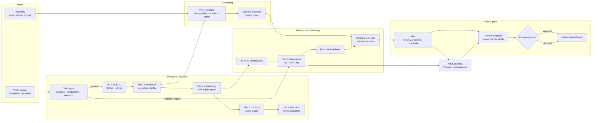

**The permission boundary runs between `MISSION` and `APPROVE`.** Everything left of it is the system reasoning.
Nothing crosses it without a human, and both answers are written to the ledger.

Three rendered diagrams live in [`artifacts/diagrams/`](artifacts/diagrams/): the system architecture, a
frame-to-dispatch sequence, and the memory pyramid.

---

## Tech Stack

<table>
<tr>
<td valign="top" width="50%">

### Perception and Reasoning
| Layer | Technology |
|---|---|
| Detection | YOLO11, CUDA, ~12 ms/frame |
| Open vocabulary | Grounding DINO (promptable rules) |
| Tracking | ByteTrack, frame-rate aware |
| Vision language | `llama-3.2-11b-vision`, 90B for deep |
| Joint embeddings | `llama-nemotron-embed-vl-1b-v2`, 2048-d |
| Text embeddings | `nv-embedqa-e5-v5`, 1024-d |
| Reasoning | Groq `llama-3.3-70b-versatile`, NVIDIA failover |
| API | FastAPI, SSE streaming |
| Storage | SQLite with `sqlite-vec` |
| Video | OpenCV decode, ffmpeg transcode |

</td>
<td valign="top" width="50%">

### Interface and Experience
| Layer | Technology |
|---|---|
| Framework | Next.js 15 App Router, TypeScript |
| Styling | Tailwind, bespoke light token set |
| Maps | MapLibre GL, MapTiler |
| Globe | react-globe.gl, threat shading, arcs |
| 3D | react-three-fiber, drei, Draco GLB |
| Motion | GSAP ScrollTrigger, Lenis, Framer |
| State | Zustand |
| Overlay | Canvas 2D, rAF, DPR-scaled |
| Reports | LaTeX, tables generated from JSON |

</td>
</tr>
</table>

---

## Data Model

One SQLite file. The schema is the contract between perception and everything downstream.

- **`frames`** id, timestamp, clip, video time, gate verdict and reason, caption, analysed flag.
- **`detections`** label, confidence, normalised bbox, track id, zone, projected ground position.
- **`entities`** persistent subjects with appearance vectors, first and last seen, visit history across sites.
- **`embeddings`** three kinds in one table: caption (1024-d), frame and crop (2048-d joint space), indexed by
  `sqlite-vec` with a numpy fallback.
- **`alerts`** severity, confidence, rule id, contributing evidence, dispatch coordinate, status lifecycle.
- **`memory`** the temporal pyramid: clip, shift and day summaries, each retaining the frame ids beneath it.
- **`missions`** waypoints, altitudes, feasibility, approval state.
- **`ledger`** hash-chained audit entries. Each row carries the hash of its predecessor.

Boxes are stored **normalised 0 to 1** of frame size, so the overlay needs no scale factor and a 960-wide index
cannot silently mis-draw on a 1920-wide clip.

---

## Evaluation

| Suite | Result | What it means |
|---|---|---|
| **Scenarios** | **8/8**, precision **1.00**, recall **1.00** | Including three that expect *silence* |
| **Chaos** | **6/6 survived** | Two deliberately expect failure |
| **Retrieval** | mean P@k **0.975** | Indicative, four queries, one session |
| **Unit and integration** | **100 passed** | No network, no API key |
| **Site-wide inspection** | **125 checks, 0 failing** | Every deck, endpoint and claim |
| **Gate, real footage** | **38.9%** skipped | The unflattering number, reported |
| **Gate, idle context** | **96.7%** skipped | What a real patrol night looks like |

> **Three of eight scenarios expect nothing to happen.** A stray dog at the fence at 03:00 has every surface
> signal of an intrusion: motion, night, high-priority zone, extended dwell. A system that alerts on it, on the
> delivery driver and on the shift change is switched off within a week. **The true negatives are the harder
> test**, and they are weighted equally.

Four PDF reports build from LaTeX in [`report/`](report/), and **every table in them is generated from the JSON
those commands write.** No number is transcribed by hand, so a stale claim becomes visible rather than persisting.

---

## What Went Wrong, and What It Cost

Each of these was invisible on inspection and changed the code.

### The alert list that lied

Asked to show recent alerts, the model called `list_alerts` with `status="all"`. That is not one of the declared
enum values, and nothing validated it, so it went straight into a SQL equality test: `WHERE status = 'all'`. It
matched nothing, and the operator was told **"there are no recent alerts"** while **four open alerts sat in the
table.**

Not an error. A confident, plausible falsehood, which is the worst failure shape available. Declaring an enum in
a schema now binds at the boundary: wildcards drop to no filter, casing is repaired, anything else is dropped.

### The video that served perfectly and would not play

`NotSupportedError: The element has no supported sources` on an uploaded `.mp4`. The HTTP layer was innocent:
200 OK, correct content type, correct length, range requests honoured. The files were **MPEG-4 Part 2 with the
index at the tail**, which no browser decodes.

The trap is that **OpenCV reads that format happily**, so indexing succeeded and only playback failed. A video
the detector can read and a video a browser can play are not the same thing. Uploads are now probed and
transcoded to H.264 with `+faststart` before indexing.

### The agent's cassettes were write-only

The system prompt embedded `datetime.now()` **to the second**. Every request payload was therefore unique, and
the cassette key is a hash of the payload, so **no recorded answer could ever match its own recording.** Replay
mode recorded hundreds of cassettes and then failed every question, which reads as a broken agent rather than an
uncacheable prompt.

Compounding it, the agent was a module-level singleton whose conversation history accumulated across every
request for the life of the process, which is also a real multi-user bug, since two operators shared one conversation.
The clock now comes from the last observation rather than the wall, which is *also* more correct: "last night"
is a question about the footage, and the footage has its own clock.

### The map that rendered nothing, three times

Blank white canvas. Fixed twice, wrongly. MapTiler was exonerated early: style JSON, tiles, sprite and glyphs all
returned 200.

The cause was that **MapLibre v6 bootstraps its worker from `import.meta.url`, which webpack inlines as a
`file:` URL**, so its `^https?:` test fails and it runs `new Worker("")`. That fetches the HTML page as a module
script and dies. No error event fires for a dead worker. Style and tiles are fetched on the main thread, which is
why everything returned 200, while tile *decoding* happens in the worker, which is why nothing painted.

The fix is a local worker copy, and then a third failure, because the worker imports a sibling `.mjs` that also
had to be copied. The sync script now walks the import chain and verifies the copy is closed over its own imports.

### Grounding DINO could not do the dense pass

540 ms/frame, and at threshold 0.55 it found **three cars in 377 frames**. Correct for open-vocabulary prompts,
unusable for indexing every frame. YOLO11 is pinned for the dense pass at 12 ms, and Grounding DINO is kept for
promptable rules. Recorded as [ADR-0002](docs/adr/0002-detector-backend.md).

### The gate reported 0% efficiency

The heartbeat was time-only and the demo compresses the site clock, so it fired on every frame, **the exact
inverse of the architecture's central claim**, with no error anywhere.

### Six more the tests caught

- **`"cat"` is inside `"location"`.** Counterfactual keywords matched as substrings, so every alert titled
  "...at a sensitive location" was suppressed as wildlife.
- **Scaling a confidence cannot express "this premise is false".** The stray-dog alert scaled to 0.2975 against a
  0.25 threshold and fired anyway. Counterfactuals now split into contradicting and mitigating.
- **Zone oscillation erased dwell.** Detections flickering between nested zones reset the clock, making loitering
  undetectable in the highest-priority zone on the site. Symptom: zero alerts, no error.
- **Label specificity.** The vision model says "sedan" where the rule says "car". Rules silently never matched.
- **A zone with no declared hours was treated as always open**, disabling the after-hours rule at exactly the
  fence line it exists to protect.
- **Uploaded footage could never alert**, because the ad-hoc zone id matched no rule in the pack.

### Verified broken, so you do not waste the time

`nvidia/nvclip` is in the NIM catalogue but its function is **not provisioned for developer keys** (404); it is
superseded by `llama-nemotron-embed-vl-1b-v2`, which is probed in all three modalities including a cross-modal
cosine, because equal dimensions prove nothing on their own. No detection model is hosted at
`ai.api.nvidia.com/v1/cv/...` at all. The reranker endpoint does not exist. `meta/llama-3.3-70b-instruct` is
offered but exceeds a 90-second read timeout, which is what pushed the primary to Groq.

---

## Honesty Constraints, Enforced in Code

- **A gated tool cannot execute without approval**, and the agent's own loop cannot pass the flag. A test reads
  the source to assert `approved=True` never appears in it.
- **A fabricated citation is caught.** The model is scripted to cite a frame that does not exist; the turn must
  come back `verified=False`. The complement matters equally: an explanation that legitimately cites nothing must
  not be penalised for it.
- **A ray above the horizon returns no position**, never a plausible coordinate. A fabricated one would send a
  responder somewhere real and wrong.
- **Simulated sites are labelled simulated** on every surface. One site carries live footage; fifteen are seeded,
  and the UI says so.
- **Uploaded telemetry is synthesised, and says so**, with a widened accuracy radius.
- **A cassette miss in replay raises** rather than silently reaching the network, which would make "runs offline"
  untrue in exactly the situation where it matters.
- **The audit chain is verified on demand**, and a tampered row is detectable.
- **Declining a mission is written to the ledger**, because a refusal you cannot prove is not a control.
- **No em dash appears in any text this project wrote**, and an inspection check fails if one returns.
- **Every number in the reports is generated from a measured run.** Re-running the evaluation regenerates the
  tables.

---

## Project Structure

```
src/kestrel/
  perception/       gate · detector · tracker · pipeline
  agent/            agent · registry · tools · selfknowledge
  rules/            compiler · pack · triage
  memory/           pyramid · baseline · entities
  retrieval/        hybrid search, rank fusion
  storage/          db · ledger
  clients/          provider transport, breaker, rate limiter, cassettes
  api/main.py       every endpoint, SSE streams, upload pipeline
  media.py          browser-playability probe and transcode
  playback.py       the dense index, shared by CLI and upload

web/
  app/              landing · command · console · investigate · entities
                    rules · analyst · evals · architecture · site/[id]
  components/       console · viz · ask · deploy · ui primitives

data/
  footage/          six real clips, licences in SOURCES.md
  playback/         dense indexes, one JSON per clip
  cassettes/        1,280 recorded model responses
  sites/            17 site definitions with zones and hours
  eval/             scenario, chaos, retrieval and gate results

scripts/
  build_playback_index.py   the dense pass
  run_evals.py              every suite
  probe_models.py           what the API actually serves
  inspect_all.py            125 end-to-end checks

report/             four LaTeX documents, tables generated from data/eval
docs/               feature spec · architecture · testing · AI tooling log · ADRs
artifacts/diagrams/ system architecture · sequence · memory pyramid
```

---

## Author

Built for the **FlytBase AI Engineer assignment**.

My thesis in one line: a patrol drone produces more frames in a shift than the free tier will ever look at, so
the interesting engineering is not the model, it is deciding which few frames deserve one, and being willing to
say, on screen, when the answer is that you do not know.

<div align="center">

<br/>

**Atharva Awade**

<br/>

**Measured, cited, or refused. Never invented.**


</div>
